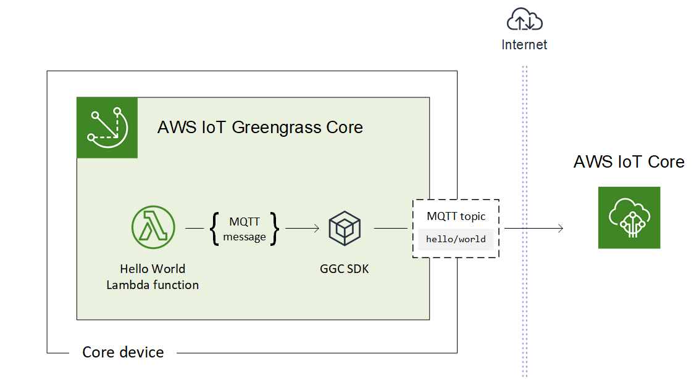

# Fully Managed Edge Services

-   Secure Communications
-   Group Management of Cores
-   OTA Provisioning and Updates

::: notes

AWS will optionally push updates to the Core software automatically.

:::

# Lambda @ Your Edge

{.stretch .plain}

::: notes
You install the core on your devices

You run AWS Lambdas on your devices
:::


# Offline Operation

-   AWS IoT Device Shadows


# Local Messaging

::: notes
Local only messaging even with no connection to AWS

Utilizes the greengrass SDK on the local devices

Processes rules and deliver messages to other devices or the cloud
:::

# Local Reource Access

-   Serial Ports
-   GPIO
-   Bluetooth

# Greengrass Connectors

* Access to hardware for Inference or GPIO
* Access to third-party APIs
* On-premises Software

::: notes
Also allows access to commond AWS services such as CloudWatch to publish metrics
or run Docker compose on Cores to launch applications
:::

# Run ML Models

-   Local Inference

::: notes
Reduce costs on transfer to the cloud
:::


# Hardware Support

-   Raspberry Pi
-   Intel Atom
-   Nvidia Jetson NX
-   ARM v7 and v8
-   Intel amd64
-   Existing IoT Hardware

::: notes
Supports many Gateways and exisiting edge devices
:::

# Quick Start

### Setup your Raspberry Pi

Grab Temporary AWS Security Credentials

```console
$ aws sts assume-role --role-arn arn:aws:iam::123456789012:role/role-name --role-session-name "RoleSession1"
```

```console
$ export AWS_ACCESS_KEY_ID=...
$ export AWS_SECRET_ACCESS_KEY=...
$ export AWS_SESSION_TOKEN="..."
```

Bootstrap Device

```console
$ wget -q -O ./gg-device-setup-latest.sh https://d1onfpft10uf5o.cloudfront.net/greengrass-device-setup/downloads/gg-device-setup-latest.sh && chmod +x ./gg-device-setup-latest.sh && sudo -E ./gg-device-setup-latest.sh bootstrap-greengrass-interactive
```

::: notes
Make sure to create the role in IAM before you try to assume it and put your account id in the command.
:::

# Concepts

* Thing
* Core
* Group

::: notes
Devices are Things
Things can also be sensors or smaller devices that connect to a Core
Core are also things, but can run the Greengrass core and recieve messages from other Things
Devices in a group can be configured to talk to each other
:::

# Hello World

``` {.stretch .python}
def greengrass_hello_world_run():
    try:
        if not my_platform:
            client.publish(
                topic="hello/world", queueFullPolicy="AllOrException", payload="Hello world! Sent from Greengrass Core."
            )
        else:
            client.publish(
                topic="hello/world",
                queueFullPolicy="AllOrException",
                payload="Hello world! Sent from " "Greengrass Core running on platform: {}".format(my_platform),
            )
    except Exception as e:
        logger.error("Failed to publish message: " + repr(e))

    # Asynchronously schedule this function to be run again in 5 seconds
    Timer(5, greengrass_hello_world_run).start()
```

::: notes
Currently, make sure you choose `python3.7` for the runtime for your lambda.
:::

# Greengrass Secrets Manager

### Works with Greengrass
* Connectors
* Lambdas

::: notes
For example API keys to external services such as Twillio, Splunk or 3rd party APIs

Greengrass Secret Resources integrates with AWS Secrets Manager

Rotate keys and distribute access to other edge resources
:::

# Greengrass Security

* Policies
* Device Defender

::: notes

* Defend
  * Ongoing Audits of the fleet, scheduled or on demand
  * Device Defender Detect monitors device activity
  * Create security profiles to define device behavior
  * Create mitigation actions
:::

# IoT Act Rules

### IFTTT for IoT on AWS

::: notes
evaluate messages coming back from your things and add actions
Send message to AWS or 3rd Party IoT services
:::

# Greengrass Pricing

-   Free tier for 3 devices for the first year
-   Up to 10k devices \-- \$0.16/month/device
-   22% discount for annual commitment

::: notes
prices for of US East 1 and US West 1 billed only in whole months They
get you on everything else

-   transfer
-   storage
:::

# Resources

-   [Getting Started Guide](http://docs.aws.amazon.com/greengrass/latest/developerguide/gg-gs.html)
-   [FAQs](https://aws.amazon.com/greengrass/faqs/)

# Questions?

## <calvin@sixfeetup.com>

[`@calvinhp`](https://twitter.com/calvinhp)
